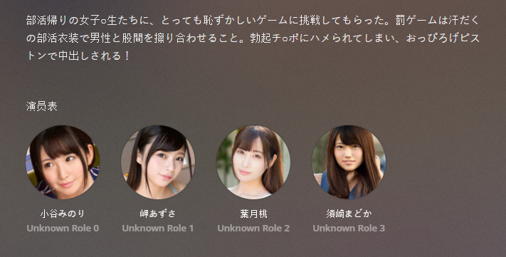

JAVnfoMoviesImporter.bundle-for-Plex

=====================================

修改自原版[XBMCnfoMoviesImporter.bundle](https://github.com/gboudreau/XBMCnfoMoviesImporter.bundle). 安装方式和原来相同.

增加了女优图像刮削的功能, 目前取自[gfriends](https://github.com/ddd354/gfriends), 仍有不完善之处, 待原作者更新以后会及时跟进.

去除了本地演员的图片的支持, 请只用于合适的库.

 

=====================================

新增本地**Filetree.json**以便网络访问失败时作为备份使用, 成功从github上取得最新版本的时候会更新本地版本.

=====================================
### Installation:
It is recommended to install the [WebTools plugin](http://forums.plex.tv/discussion/288191/webtools-unsupported-appstore/p1).

Using the Unsupported Appstore from WebTools it is possible
to easily install, update and remove the Agent, without having
to go through the hassle of manually downloading, unzipping,
renaming and moving it to the correct directory each time.

After successfully installing WebTools please login and select the
"Unsupported Appstore" Module. There you click on the "Agent" tab,
scroll down and can now easily install the XBMCnfoMoviesImporter.

### Manual Installation:
Not recommended, but possible if you know what you are doing.

1. Download the [zipped bundle](https://github.com/gboudreau/XBMCnfoMoviesImporter.bundle/archive/master.zip) from github,
2. extract it,
3. rename it to **XBMCnfoMoviesImporter.bundle**,
4. find the [Plex Media Server data directory](https://support.plex.tv/hc/en-us/articles/202915258-Where-is-the-Plex-Media-Server-data-directory-located)
5. move the .bundle folder to the Plug-ins directory,
6. restart plex and test,
7. if necessary change the owner and permissions of the .bundle and
8. restart plex again.

User MattJ from the plex forum reported the following steps to install on ubuntu 14.04:
- Download from github and unzip
- Remove "-master" from the end of both folder names.
- Copy them to the folder:  /var/lib/plexmediaserver/Library/Application Support/Plex Media Server/Plug-ins
- Find the group number for user "plex" by command "id plex".
- "cd" to folder in step 3 and change ownership of both XBMC bundles: "sudo chown plex:{gid} XBMC*"
- run "sudo service plexmediaserver restart".
Done.
